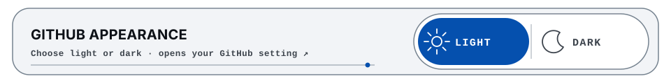

<!-- GENERATED FILE: edit src/ and scripts/, then run npm run build. -->

<a href="https://github.com/settings/appearance">
<picture>
  <source media="(max-width: 1080px) and (prefers-color-scheme: dark)" srcset="assets/generated/theme-control-mobile-dark.svg">
  <source media="(max-width: 1080px)" srcset="assets/generated/theme-control-mobile-light.svg">
  <source media="(prefers-color-scheme: dark)" srcset="assets/generated/theme-control-dark.svg">
  
</picture>
</a>

<picture>
  <source media="(prefers-reduced-motion: reduce) and (prefers-color-scheme: dark)" srcset="assets/generated/hero-static-dark.svg">
  <source media="(prefers-reduced-motion: reduce)" srcset="assets/generated/hero-static-light.svg">
  <source media="(prefers-color-scheme: dark)" srcset="assets/generated/hero-dark.svg">
  
</picture>

<picture>
  <source media="(prefers-reduced-motion: reduce) and (max-width: 1080px) and (prefers-color-scheme: dark)" srcset="assets/generated/systems-mobile-static-dark.svg">
  <source media="(prefers-reduced-motion: reduce) and (max-width: 1080px)" srcset="assets/generated/systems-mobile-static-light.svg">
  <source media="(prefers-reduced-motion: reduce) and (prefers-color-scheme: dark)" srcset="assets/generated/systems-static-dark.svg">
  <source media="(prefers-reduced-motion: reduce)" srcset="assets/generated/systems-static-light.svg">
  <source media="(max-width: 1080px) and (prefers-color-scheme: dark)" srcset="assets/generated/systems-mobile-dark.svg">
  <source media="(max-width: 1080px)" srcset="assets/generated/systems-mobile-light.svg">
  <source media="(prefers-color-scheme: dark)" srcset="assets/generated/systems-dark.svg">
  
</picture>

<picture>
  <source media="(prefers-reduced-motion: reduce) and (max-width: 1080px) and (prefers-color-scheme: dark)" srcset="assets/generated/architecture-mobile-static-dark.svg">
  <source media="(prefers-reduced-motion: reduce) and (max-width: 1080px)" srcset="assets/generated/architecture-mobile-static-light.svg">
  <source media="(prefers-reduced-motion: reduce) and (prefers-color-scheme: dark)" srcset="assets/generated/architecture-static-dark.svg">
  <source media="(prefers-reduced-motion: reduce)" srcset="assets/generated/architecture-static-light.svg">
  <source media="(max-width: 1080px) and (prefers-color-scheme: dark)" srcset="assets/generated/architecture-mobile-dark.svg">
  <source media="(max-width: 1080px)" srcset="assets/generated/architecture-mobile-light.svg">
  <source media="(prefers-color-scheme: dark)" srcset="assets/generated/architecture-dark.svg">
  
</picture>

<picture>
  <source media="(prefers-reduced-motion: reduce) and (max-width: 1080px) and (prefers-color-scheme: dark)" srcset="assets/generated/signal-mobile-static-dark.svg">
  <source media="(prefers-reduced-motion: reduce) and (max-width: 1080px)" srcset="assets/generated/signal-mobile-static-light.svg">
  <source media="(prefers-reduced-motion: reduce) and (prefers-color-scheme: dark)" srcset="assets/generated/signal-static-dark.svg">
  <source media="(prefers-reduced-motion: reduce)" srcset="assets/generated/signal-static-light.svg">
  <source media="(max-width: 1080px) and (prefers-color-scheme: dark)" srcset="assets/generated/signal-mobile-dark.svg">
  <source media="(max-width: 1080px)" srcset="assets/generated/signal-mobile-light.svg">
  <source media="(prefers-color-scheme: dark)" srcset="assets/generated/signal-dark.svg">
  
</picture>
