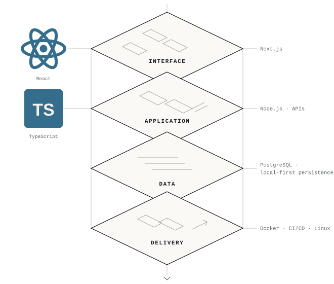
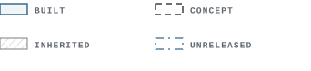
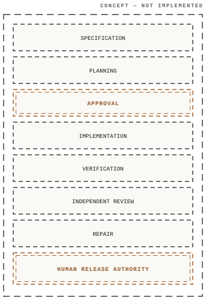
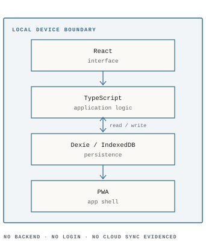
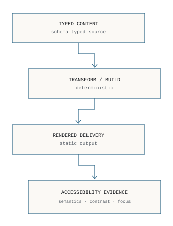
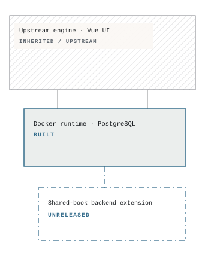
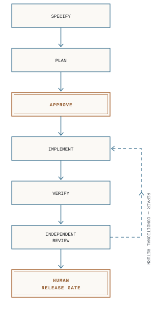

# Hakan Duyar

**Front-end & Systems Engineering**

React and TypeScript at the core — four systems carrying work from application architecture to verified, human-controlled delivery.

<picture>
  <source media="(prefers-color-scheme: dark)" srcset="assets/v6/hero-dark.svg">
  
</picture>

## Selected systems — evidence

<picture>
  <source media="(prefers-color-scheme: dark)" srcset="assets/v6/legend-dark.svg">
  
</picture>

**01 · Software Factory** — CONCEPT

<picture>
  <source media="(prefers-color-scheme: dark)" srcset="assets/v6/system-01-software-factory-dark.svg">
  
</picture>

An engineering control plane separating definition, execution, assurance, and release authority.
Direction only — no issue/PR automation, orchestration, deployment, or control-room UI built.

**02 · Spark** — BUILT

<picture>
  <source media="(prefers-color-scheme: dark)" srcset="assets/v6/system-02-spark-dark.svg">
  
</picture>

Local-first planning application — React, TypeScript, Dexie/IndexedDB, PWA shell.
Runs entirely on-device; no automated test suite claimed.

**03 · Built in Layers** — BUILT

<picture>
  <source media="(prefers-color-scheme: dark)" srcset="assets/v6/system-03-built-in-layers-dark.svg">
  
</picture>

Typed content moved through a deterministic build into rendered, accessible delivery.
Architecture evidence — not a full design system; no WCAG AAA claim.

**04 · JointLedger** — BUILT — RUNTIME CONTRIBUTION

<picture>
  <source media="(prefers-color-scheme: dark)" srcset="assets/v6/system-04-jointledger-dark.svg">
  
</picture>

Docker and PostgreSQL runtime contribution to an upstream accounting system.
Engine and Vue UI inherited; shared-book UI, selector, and invitation flow not claimed.

## Verified agentic delivery

Human authority sits at two gates: approve and release.

<picture>
  <source media="(prefers-color-scheme: dark)" srcset="assets/v6/delivery-route-dark.svg">
  
</picture>

---

Hakan Duyar · [GitHub — repositories](https://github.com/hakanduyar) · [LinkedIn](https://www.linkedin.com/in/hakanduyar) · [hakanbtgm@gmail.com](mailto:hakanbtgm@gmail.com)
