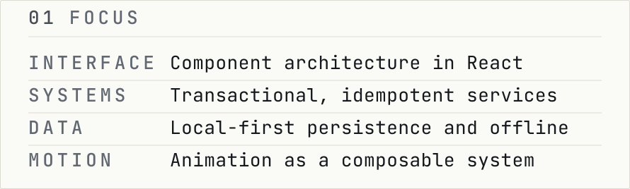
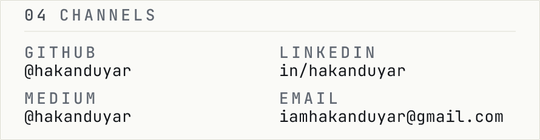

<!-- GENERATED FILE - do not edit by hand.
     Source: scripts/generate/readme.ts
     Data:   data/telemetry.json (measured 2026-08-24)
     Build:  npm run build -->

<picture>
  <source media="(prefers-reduced-motion: reduce) and (prefers-color-scheme: dark)" srcset="assets/generated/identity-static-dark.svg">
  <source media="(prefers-reduced-motion: reduce)" srcset="assets/generated/identity-static-light.svg">
  <source media="(prefers-color-scheme: dark)" srcset="assets/generated/identity-dark.svg">
  
</picture>

**Hakan Duyar — interface and systems engineer. TypeScript, React, Node.**

<picture>
  <source media="(prefers-color-scheme: dark)" srcset="assets/generated/focus-dark.svg">
  
</picture>

<a href="https://github.com/hakanduyar/dropspot-project">
<picture>
  <source media="(prefers-color-scheme: dark)" srcset="assets/generated/system-dropspot-dark.svg">
  
</picture>
</a>

<a href="https://github.com/hakanduyar/Hunnes-Academy-motion-system">
<picture>
  <source media="(prefers-color-scheme: dark)" srcset="assets/generated/system-motion-system-dark.svg">
  
</picture>
</a>

<a href="https://github.com/hakanduyar/stock-management-system">
<picture>
  <source media="(prefers-color-scheme: dark)" srcset="assets/generated/system-stock-dark.svg">
  
</picture>
</a>

<a href="https://github.com/hakanduyar/spark">
<picture>
  <source media="(prefers-color-scheme: dark)" srcset="assets/generated/system-spark-dark.svg">
  
</picture>
</a>

<picture>
  <source media="(prefers-reduced-motion: reduce) and (prefers-color-scheme: dark)" srcset="assets/generated/signal-static-dark.svg">
  <source media="(prefers-reduced-motion: reduce)" srcset="assets/generated/signal-static-light.svg">
  <source media="(prefers-color-scheme: dark)" srcset="assets/generated/signal-dark.svg">
  
</picture>

<picture>
  <source media="(prefers-color-scheme: dark)" srcset="assets/generated/channels-dark.svg">
  
</picture>

[GitHub](https://github.com/hakanduyar) · [LinkedIn](https://www.linkedin.com/in/hakanduyar) · [Medium](https://medium.com/@hakanduyar) · [Email](mailto:iamhakanduyar@gmail.com)

*Every image on this page is generated from source in this repository. Nothing is fetched from a third-party service. Measured 2026-08-24. Source: [hakanduyar/hakanduyar](https://github.com/hakanduyar/hakanduyar).*
