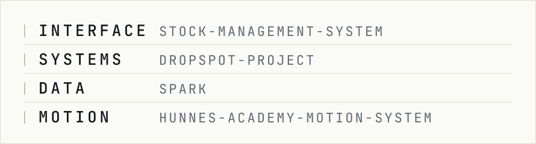
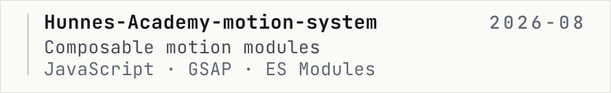
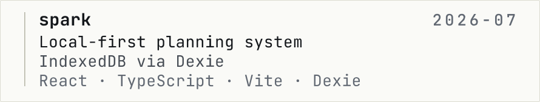
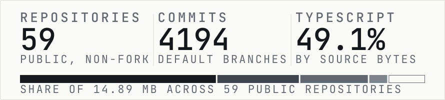
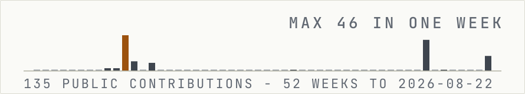

<!-- GENERATED FILE - do not edit by hand.
     Source: scripts/generate/readme.ts
     Data:   data/telemetry.json (measured 2026-08-23)
     Build:  npm run build -->

<picture>
  <source media="(prefers-reduced-motion: reduce) and (prefers-color-scheme: dark)" srcset="assets/generated/hero-static-dark.svg">
  <source media="(prefers-reduced-motion: reduce)" srcset="assets/generated/hero-static-light.svg">
  <source media="(prefers-color-scheme: dark)" srcset="assets/generated/hero-dark.svg">
  
</picture>

**Hakan Duyar — interface and systems engineer. TypeScript, React, Node.**

## Identity

I build interfaces in TypeScript and React, and the services behind them when a project needs one. The work I lead with here is complete applications - a limited-stock drop platform with idempotent claim handling, a role-aware inventory service, a local-first planning app that runs with no backend at all. The rest of the account is the practice that got me there.

The parts I care about are the ones that decide whether software survives real use: data integrity under concurrency, honest state management, performance, and accessibility treated as correctness rather than as a later pass.

## Core modules

<picture>
  <source media="(prefers-color-scheme: dark)" srcset="assets/generated/core-modules-dark.svg">
  
</picture>

- **Interface** — Component architecture, routing and form/state handling in React, Next.js and TypeScript, built against real backends rather than mock data. Evidence: [stock-management-system](https://github.com/hakanduyar/stock-management-system).
- **Systems** — Server-side design where correctness is the hard part: transactional writes, idempotent operations, priority-scored queues and role-based access control. Evidence: [dropspot-project](https://github.com/hakanduyar/dropspot-project).
- **Data** — Client-side persistence and offline behaviour — IndexedDB schemas, local-first sync boundaries, and deciding what genuinely needs a server. Evidence: [spark](https://github.com/hakanduyar/spark).
- **Motion** — Animation as a system: composable modules behind one configuration, scoped per route and shipped as a single bundle. Evidence: [Hunnes-Academy-motion-system](https://github.com/hakanduyar/Hunnes-Academy-motion-system).

## Selected systems

<a href="https://github.com/hakanduyar/dropspot-project">
<picture>
  <source media="(prefers-color-scheme: dark)" srcset="assets/generated/system-dropspot-dark.svg">
  
</picture>
</a>

**[dropspot-project](https://github.com/hakanduyar/dropspot-project)** — Limited-stock drop platform with fair, idempotent claim distribution.

- Priority-scored waitlist decides who converts when stock is scarce
- Idempotent claim operations and ACID transactions keep concurrent buyers consistent
- Documented data model, API surface and seed generation

Stack: Node.js · Express · PostgreSQL · React. Last public push: 2025-11.

<a href="https://github.com/hakanduyar/Hunnes-Academy-motion-system">
<picture>
  <source media="(prefers-color-scheme: dark)" srcset="assets/generated/system-motion-system-dark.svg">
  
</picture>
</a>

**[Hunnes-Academy-motion-system](https://github.com/hakanduyar/Hunnes-Academy-motion-system)** — A reusable motion layer built as one system, not a pile of one-off animations.

- Nine motion modules over a shared base, behind one declarative config
- Page-scoped router activates only the motions a route needs
- Ships as a single built bundle for drop-in use

Stack: JavaScript · GSAP · ES Modules. Last public push: 2026-08.

<a href="https://github.com/hakanduyar/stock-management-system">
<picture>
  <source media="(prefers-color-scheme: dark)" srcset="assets/generated/system-stock-dark.svg">
  
</picture>
</a>

**[stock-management-system](https://github.com/hakanduyar/stock-management-system)** — Role-aware inventory system covering the full stock movement lifecycle.

- Three-role access model: admin, storekeeper, employee
- JWT authentication over a Prisma/PostgreSQL schema
- Stock-in / stock-out movements tracked as first-class records

Stack: NestJS · Next.js · PostgreSQL · Prisma. Last public push: 2025-11.

<a href="https://github.com/hakanduyar/spark">
<picture>
  <source media="(prefers-color-scheme: dark)" srcset="assets/generated/system-spark-dark.svg">
  
</picture>
</a>

**[spark](https://github.com/hakanduyar/spark)** — Local-first planning system that works with no backend and no network.

- All state lives in IndexedDB via Dexie — no server, no account
- Installable offline PWA built mobile-first
- Optional AI layer is additive, never required to use the app

Stack: React · TypeScript · Vite · Dexie. Last public push: 2026-07.

## Telemetry

<picture>
  <source media="(prefers-color-scheme: dark)" srcset="assets/generated/telemetry-dark.svg">
  
</picture>

| Measure | Value | Method |
|---|---:|---|
| Public repositories | 55 | public, non-fork, owned by @hakanduyar |
| Commits | 870 | default branches, undefined public repositories |
| TypeScript | 64.2% | share of 3.86 MB public source |
| JavaScript | 17.0% | share of 3.86 MB public source |
| HTML | 11.5% | share of 3.86 MB public source |
| CSS | 3.4% | share of 3.86 MB public source |
| All other languages | 3.9% | 8 languages |
| Active since | 2021 | GitHub account created 2021-02-20 |
| Last public push | 2026-08-16 | most recent push to a public repository |

Measured 2026-08-23 from the GitHub API. No estimated or third-party figures.

## Activity

<picture>
  <source media="(prefers-color-scheme: dark)" srcset="assets/generated/activity-dark.svg">
  
</picture>

135 public contributions in the 52 weeks to 2026-08-22, concentrated in 9 active weeks with a peak of 46 in one week.

## Active work

- **[Hunnes-Academy-motion-system](https://github.com/hakanduyar/Hunnes-Academy-motion-system)** — A reusable motion layer built as one system, not a pile of one-off animations. Last push 2026-08.
- **[spark](https://github.com/hakanduyar/spark)** — Local-first planning system that works with no backend and no network. Last push 2026-07.

Some current work is in private repositories, so public activity understates recent output.

## Operating principles

- Understand a system before automating it.
- Performance is a feature, and it is cheapest to add first.
- Accessibility is correctness, not decoration.
- Prefer fewer moving parts over clever ones.
- A tool can write the code; the engineer still owns the decision.

## Channels

- GitHub: [@hakanduyar](https://github.com/hakanduyar)
- LinkedIn: [in/hakanduyar](https://www.linkedin.com/in/hakanduyar)
- Medium: [@hakanduyar](https://medium.com/@hakanduyar)
- Email: [iamhakanduyar@gmail.com](mailto:iamhakanduyar@gmail.com)

*Every image on this page is generated from source in this repository. Nothing is fetched from a third-party service. Data measured 2026-08-23. Source: [hakanduyar/hakanduyar](https://github.com/hakanduyar/hakanduyar). Build: `npm run build`.*
