# Hakan Duyar

**Front-end & Systems Engineering**

React and TypeScript at the core — architecture carried through data, delivery, and runtime to verified, human-gated release.

<picture>
  <source media="(prefers-color-scheme: dark)" srcset="v7/assets/generated/v7-desktop-dark.svg">
  
</picture>

## Engineering architecture

React and TypeScript are the primary engineering focus. Supporting technologies are shown in their system roles rather than as a badge wall:

- **Data** — PostgreSQL, Redis, Elasticsearch
- **Delivery** — Docker, Kubernetes, Nginx, Apache
- **Runtime** — Linux, Ubuntu, Debian

## Selected systems

1. **Software Factory — Concept.** Engineering control plane separating specification, execution, assurance, and release authority. Direction only; no issue/PR automation, orchestration, deployment, or control-room UI is claimed.
2. **Spark — Built.** Local-first planning application running on-device as a PWA. No backend, login, cloud sync, or automated test suite is claimed.
3. **Built in Layers — Built.** Typed content through a deterministic build into rendered, accessible delivery. Architecture evidence, not a full design system or WCAG AAA claim.
4. **JointLedger — Runtime contribution.** Docker and PostgreSQL runtime contribution to an upstream accounting product. The engine and UI are inherited; unreleased shared-book areas are not claimed as built.

## AI-assisted delivery

Structured work moves from specification to planning, human approval, implementation, verification, independent review, repair when needed, and a final human release gate.

---

Hakan Duyar · [GitHub — repositories](https://github.com/hakanduyar) · [LinkedIn](https://www.linkedin.com/in/hakanduyar) · [hakanbtgm@gmail.com](mailto:hakanbtgm@gmail.com)
