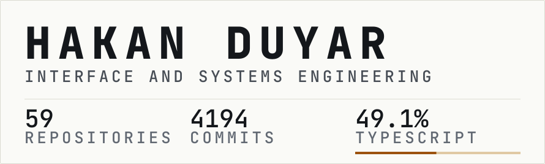
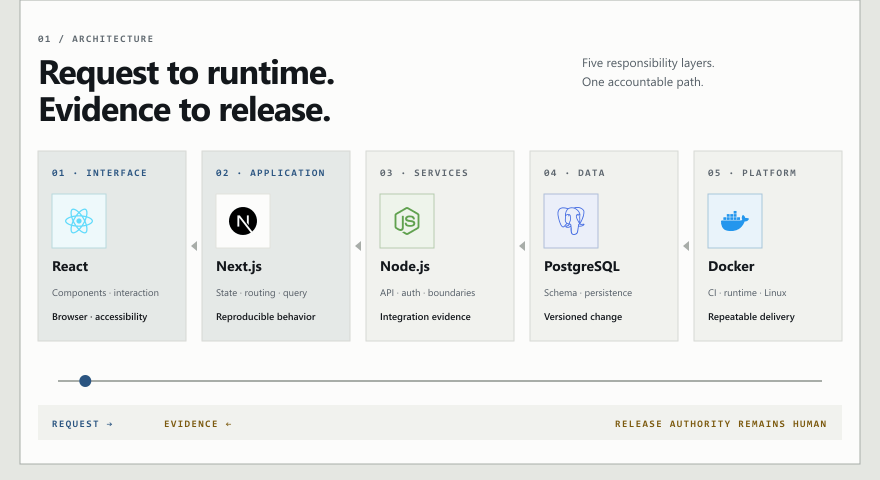
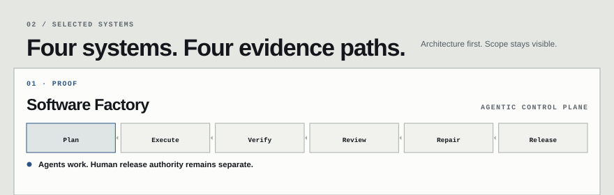
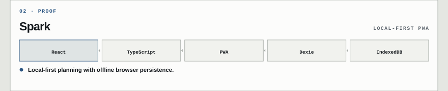
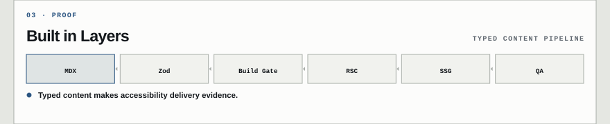
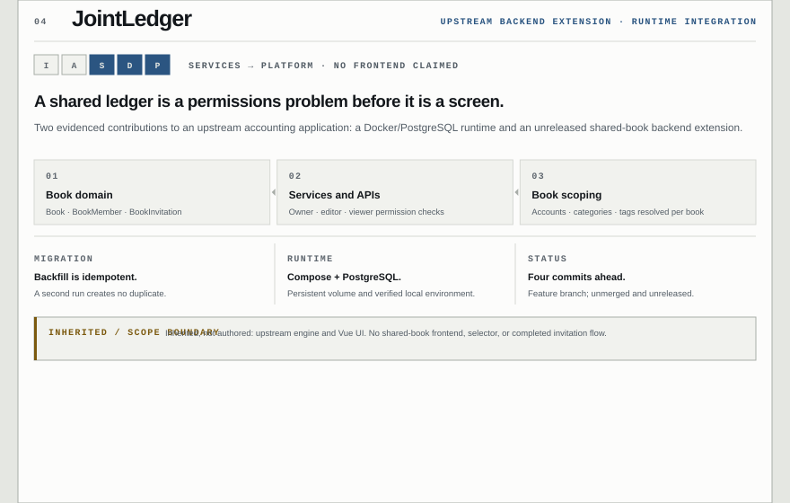
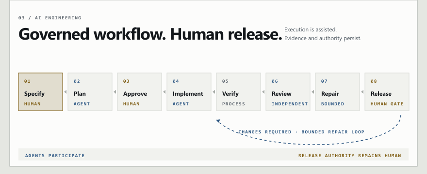
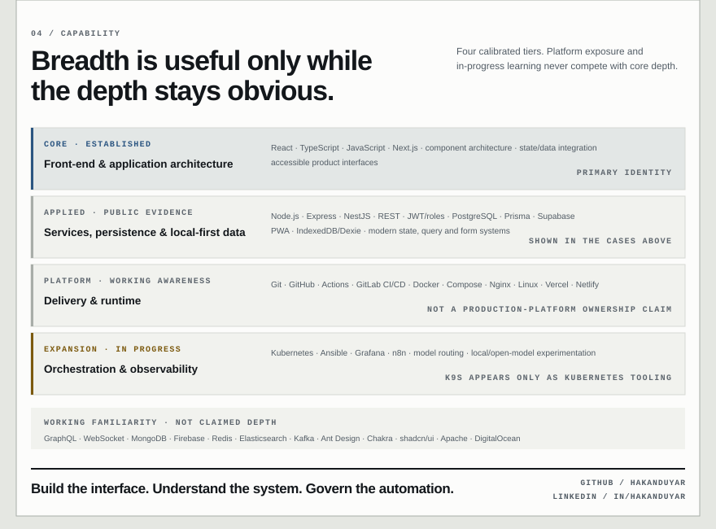

<!-- GENERATED FILE: edit src/v5/ and scripts/, then run npm run build. -->
<picture><source media="(max-width: 600px)" srcset="assets/generated/identity-mobile-dark.svg"><source media="(prefers-color-scheme: dark)" srcset="assets/generated/identity-dark.svg"></picture>

<picture><source media="(max-width: 600px)" srcset="assets/generated/expand-mobile-dark.svg"><source media="(prefers-color-scheme: dark)" srcset="assets/generated/expand-dark.svg"></picture>
<picture><source media="(max-width: 600px) and (prefers-reduced-motion: reduce)" srcset="assets/generated/architecture-mobile-static-dark.svg"><source media="(prefers-reduced-motion: reduce)" srcset="assets/generated/architecture-static-dark.svg"><source media="(max-width: 600px)" srcset="assets/generated/architecture-mobile-dark.gif"><source media="(prefers-color-scheme: dark)" srcset="assets/generated/architecture-dark.gif"></picture><a href="https://github.com/hakanduyar/software-factory"><picture><source media="(max-width: 600px)" srcset="assets/generated/project-factory-mobile-dark.svg"><source media="(prefers-color-scheme: dark)" srcset="assets/generated/project-factory-dark.svg"></picture></a><a href="https://github.com/hakanduyar/spark"><picture><source media="(max-width: 600px)" srcset="assets/generated/project-spark-mobile-dark.svg"><source media="(prefers-color-scheme: dark)" srcset="assets/generated/project-spark-dark.svg"></picture></a><a href="https://github.com/hakanduyar/built-in-layers"><picture><source media="(max-width: 600px)" srcset="assets/generated/project-layers-mobile-dark.svg"><source media="(prefers-color-scheme: dark)" srcset="assets/generated/project-layers-dark.svg"></picture></a><a href="https://github.com/hakanduyar/jointledger"><picture><source media="(max-width: 600px)" srcset="assets/generated/project-ledger-mobile-dark.svg"><source media="(prefers-color-scheme: dark)" srcset="assets/generated/project-ledger-dark.svg"></picture></a><picture><source media="(max-width: 600px) and (prefers-reduced-motion: reduce)" srcset="assets/generated/ai-mobile-static-dark.svg"><source media="(prefers-reduced-motion: reduce)" srcset="assets/generated/ai-static-dark.svg"><source media="(max-width: 600px)" srcset="assets/generated/ai-mobile-dark.gif"><source media="(prefers-color-scheme: dark)" srcset="assets/generated/ai-dark.gif"></picture><picture><source media="(max-width: 600px)" srcset="assets/generated/capability-mobile-dark.svg"><source media="(prefers-color-scheme: dark)" srcset="assets/generated/capability-dark.svg"></picture>

