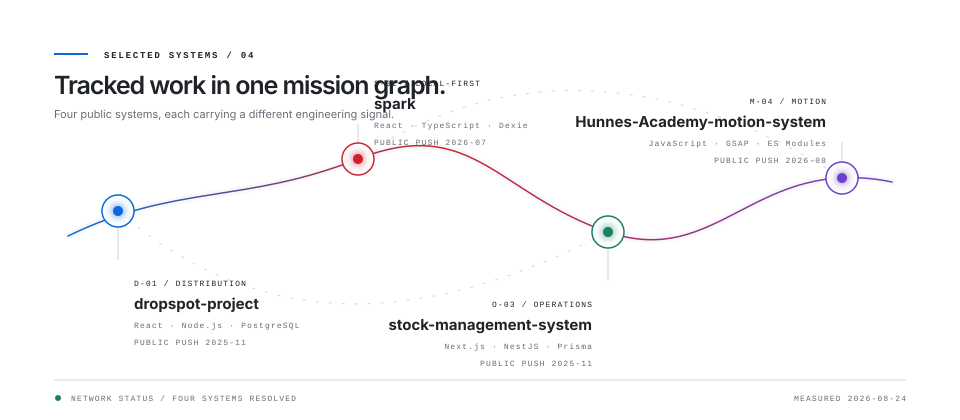

<!-- GENERATED FILE: edit src/ and scripts/, then run npm run build. -->

<picture>
  <source media="(prefers-reduced-motion: reduce) and (prefers-color-scheme: dark)" srcset="assets/generated/hero-static-dark.svg">
  <source media="(prefers-reduced-motion: reduce)" srcset="assets/generated/hero-static-light.svg">
  <source media="(prefers-color-scheme: dark)" srcset="assets/generated/hero-dark.svg">
  
</picture>

**Front-end and systems engineering. TypeScript, React, Node.**

I build product interfaces and the systems behind them, with particular attention to state, data integrity, performance, and accessibility.

## Selected systems

<picture>
  <source media="(prefers-color-scheme: dark)" srcset="assets/generated/systems-dark.svg">
  
</picture>

- [dropspot-project](https://github.com/hakanduyar/dropspot-project) — Limited-stock distribution with fair, idempotent claim handling. _React · Node.js · PostgreSQL_
- [spark](https://github.com/hakanduyar/spark) — Offline planning that runs without an account or backend. _React · TypeScript · Dexie_
- [stock-management-system](https://github.com/hakanduyar/stock-management-system) — Role-aware inventory across the stock movement lifecycle. _Next.js · NestJS · Prisma_
- [Hunnes-Academy-motion-system](https://github.com/hakanduyar/Hunnes-Academy-motion-system) — Composable motion modules behind one declarative system. _JavaScript · GSAP · ES Modules_

## Architecture

<picture>
  <source media="(prefers-color-scheme: dark)" srcset="assets/generated/architecture-dark.svg">
  
</picture>

The work moves from interface decisions through state and services into delivery. AI-assisted development supports the process; engineering judgment remains accountable.

## Public signal

<picture>
  <source media="(prefers-color-scheme: dark)" srcset="assets/generated/signal-dark.svg">
  
</picture>

The signal above is generated from GitHub's public GraphQL data: **135 contributions across 52 complete weeks**, **59 public repositories**, and **4,244 default-branch commits**. Snapshot: 2026-08-24.

## Current public work

- [software-factory](https://github.com/hakanduyar/software-factory) — pushed Aug 2026
- [hunnes-ikas-theme](https://github.com/hakanduyar/hunnes-ikas-theme) — pushed Aug 2026; Hunnes storefront — ikas Studio Code Mode theme
- [portfolio](https://github.com/hakanduyar/portfolio) — pushed Aug 2026; Personal portfolio and engineering case studies — Built in Layers

## Channels

[GitHub](https://github.com/hakanduyar) · [LinkedIn](https://www.linkedin.com/in/hakanduyar) · [Medium](https://medium.com/@hakanduyar) · [Email](mailto:iamhakanduyar@gmail.com)

Every visual is generated from source in this repository. No third-party statistics or remote image services are used.
